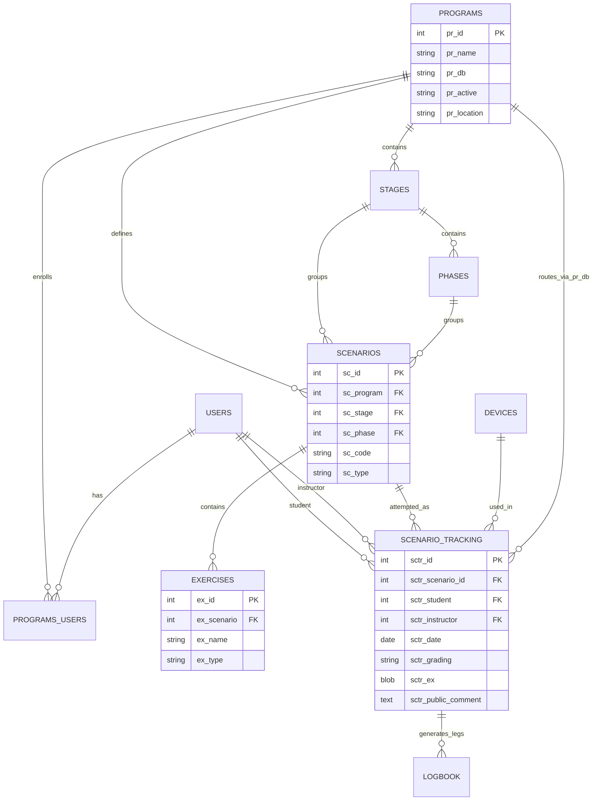

# Database Discovery Report — Historical Flight Training (E-gle)

**Status:** Phase 0–2 complete (read-only inspection only)  
**Source system:** E-gle Online (legacy operational training platform)  
**Host platform:** Combell MySQL (`mysql056.hosting.combell.com`) — **not** the DigitalOcean IPCA Courseware DB  
**Database:** `ID127947_egl1`  
**Server:** MySQL 5.7.44-51-log (`com-linmysql056`)  
**Inspection date:** 2026-08-10  
**Safety posture:** Production treated as **READ ONLY**. No schema changes, no writes, no index changes. Analytics artifacts written only under `tmp/analytics/` in this repo.

> Credentials are not recorded in this document. Connection details live in the legacy E-gle `dbase.php` pattern and the existing IPCA `EgleConnectionService` (session/temporary credentials).

---

## 0. Executive map

The historical training evidence is **not** in `ipca_courseware`. It is in the **E-gle** database on Combell.

Training records are stored as:

```
programs
  └── stages
        └── phases
              └── scenarios  (missions / lessons)
                    └── exercises  (tasks; required DE/EX/PR/PE encoded in ex_name)

users (students + instructors)
devices (aircraft / simulator / briefing / office)

scenario_tracking_<PROGRAM>   ← one table per program; one row ≈ one training session
  ├── sctr_grading            ← overall session grade (RC/RI/YC/YI/GC/GI/BC/BI)
  ├── sctr_ex (PHP serialize) ← per-exercise achieved color R/Y/G/B/D
  ├── sctr_srm (serialize)    ← SRM dimension grades
  ├── sctr_ksa (some programs)← KSA grades (EASA ACP)
  ├── sctr_public_comment / sctr_private_comment
  └── dual/pic/fnpt/brief times + device + next/alternative scenario

logbook
  └── legs linked to scenario_tracking rows via (lb_db, lb_sctr)
```

Declared MySQL foreign keys almost do not exist for the training core (only 5 FKs in the whole DB, none on training tables). Relationships are **logical / application-enforced**.

---

## 1. Potentially relevant tables

### 1.1 Core training effectiveness tables (HIGH priority)

| Table | Approx rows* | Role |
|---|---:|---|
| `users` | 884 | Students, instructors, admins |
| `programs` | 22 | Training programs; `pr_db` names the tracking table |
| `programs_users` | 1,181 | Program enrollments |
| `stages` | 77 | Curriculum stages within a program |
| `phases` | 150 | Phases within a stage (min dual/PIC/FNPT/brief hours) |
| `scenarios` | 714 | Missions/lessons |
| `exercises` | 40,824 | Tasks/competencies under a scenario |
| `devices` | 31 | Aircraft, simulators, briefing rooms, etc. |
| `scenario_tracking_*` | **27,982** total | Session / evaluation records (21 program tables) |
| `logbook` | 31,078 | Flight legs tied to sessions |

\*Exact counts from live `COUNT(*)` where noted in §B below; `information_schema.TABLE_ROWS` is approximate.

### 1.2 Scenario tracking tables (by program)

| Table | Exact rows | Date range (non-zero) | Notes |
|---|---:|---|---|
| `scenario_tracking_PPLA` | 6,398 | 2019-04-28 → 2026-08-07 | Current EASA PPL(A) |
| `scenario_tracking_EASAACP` | 5,406 | 2023-10-10 → 2026-08-10 | EASA Airline Career Program |
| `scenario_tracking_IR` | 5,218 | 2014-01-08 → 2026-08-03 | Legacy/current IR (longest span) |
| `scenario_tracking_PPL` | 3,290 | 2015-01-22 → 2022-11-12 | **Old** PPL; superseded by PPLA |
| `scenario_tracking_CPLAUPRT` | 1,092 | 2020-01-15 → 2026-08-05 | CPL(A) |
| `scenario_tracking_FIA` | 1,036 | 2016-06-23 → 2026-08-08 | FI(A) |
| `scenario_tracking_MEPNEW` | 974 | 2020-04-24 → 2026-07-25 | Current MEP |
| `scenario_tracking_APSMCC` | 934 | 2020-11-09 → 2026-08-07 | APS MCC |
| `scenario_tracking_FAAACP` | 899 | 2022-08-01 → 2026-08-06 | FAA ACP (US) |
| `scenario_tracking_IRNEWME` | 837 | 2023-08-22 → 2026-08-07 | EASA ME IR |
| `scenario_tracking_MEP` | 507 | 2016-02-19 → 2021-06-28 | Old MEP |
| `scenario_tracking_AUPRT` | 363 | 2020-05-13 → 2026-06-09 | Advanced UPRT |
| `scenario_tracking_CPLA` | 282 | 2016-09-01 → 2020-02-28 | Old CPL |
| `scenario_tracking_IRNEW` | 276 | 2023-08-22 → 2026-07-31 | EASA SE IR |
| `scenario_tracking_SCREENING` | 204 | 2021-06-23 → 2026-07-25 | ACP Screening |
| `scenario_tracking_NQ` | 131 | 2018-10-17 → 2023-12-19 | Night Rating |
| `scenario_tracking_IRI` | 65 | 2016-08-23 → 2026-05-19 | IRI |
| `scenario_tracking_MCCI` | 52 | 2020-11-10 → 2026-04-03 | MCCI |
| `scenario_tracking_AIRLINE` | 15 | 2021-05-24 → 2024-11-05 | Airline assessments |
| `scenario_tracking_CFI` | 3 | 2025-12-09 | FAA CFI (new/sparse) |
| `scenario_tracking_EXP` | 0 | — | Empty |

### 1.3 Supporting / secondary tables

- `contracts`, `contracts_user` — contractual enrollment evidence
- `checklist`, `checklist_user`
- `licenses_users`, `medicals_users`, `ratings_users`, `signatures_users`
- `training_keys_users`, `training_tools`, `training_tools_users`
- `ass_programs`, `ass_users` — assessment-related
- `cohorts*` — recent/sparse; not the historical backbone
- `activity_logs`, `activity_reports`
- `exercises_backup`, `exercises_backup_2`, `scenarios_backup*` — curriculum snapshots / recovery copies
- `DL_*`, `INSTR_*`, QDB tables — **theory question banks**; useful later for theory analytics, out of scope for flight-training effectiveness Phase 1 core

### 1.4 Full inventory

606 tables exist in the database. Compact dumps:

- `tmp/analytics/01_tables.json`
- `tmp/analytics/09_all_columns_compact.json` (11,569 columns)

---

## 2. Primary keys

| Entity | PK |
|---|---|
| User | `users.userid` |
| Program | `programs.pr_id` |
| Enrollment | `programs_users.pu_id` |
| Stage | `stages.st_id` |
| Phase | `phases.ph_id` |
| Scenario/mission | `scenarios.sc_id` |
| Exercise | `exercises.ex_id` |
| Device | `devices.dev_id` |
| Training session | `scenario_tracking_*.sctr_id` (per-program table) |
| Logbook leg | `logbook.lb_id` |

**Important:** `scenarios.sc_code` (e.g. `1-1-1`) is **not** globally unique — the same code is reused across many programs. Always key missions by `sc_id` (and program).

---

## 3. Foreign keys / logical relationships

### Declared MySQL FKs
Only 5 declared FKs in the entire database; **none** link the core training graph (`users` ↔ `scenario_tracking_*` ↔ `scenarios` ↔ `exercises`). See `tmp/analytics/04_foreign_keys.json`.

### Logical relationships (application-enforced)

```
programs.pr_id
  ← stages.st_program
  ← scenarios.sc_program
  ← programs_users.pu_program
  → programs.pr_db = name of scenario_tracking_<X> table

stages.st_id ← phases.ph_stage
phases.ph_id ← scenarios.sc_phase
stages.st_id ← scenarios.sc_stage

scenarios.sc_id ← exercises.ex_scenario
scenarios.sc_id ← scenario_tracking_*.sctr_scenario_id

users.userid ← scenario_tracking_*.sctr_student
users.userid ← scenario_tracking_*.sctr_instructor
users.userid ← programs_users.pu_user
users.userid ← logbook.lb_student / lb_instr

devices.dev_id ← scenario_tracking_*.sctr_device
devices.dev_id ← logbook.lb_dev

scenario_tracking_*.sctr_id + programs.pr_db
  ← logbook.lb_sctr + logbook.lb_db
```

`sctr_next` / `sctr_alternative` appear to reference other scenario IDs (progression / alternate mission), not other session IDs — confirm during extraction.

---

## 4–9. Identifier fields

| Concept | Field(s) |
|---|---|
| Student ID | `users.userid` where `type='STUDENT'`; also `sctr_student`, `pu_user`, `lb_student` |
| Instructor ID | `users.userid` where `type='INSTRUCTOR'`; also `sctr_instructor`, `lb_instr` |
| Program ID | `programs.pr_id`; tracking table via `pr_db` |
| Course / curriculum unit | No separate “course” entity for flight training; closest are `stages` + `phases` + `scenarios` |
| Mission/lesson ID | `scenarios.sc_id` (+ `sc_code`, `sc_name`, `sc_order`) |
| Flight/sim/ground session | `scenario_tracking_*.sctr_id` with `sctr_type` ∈ {`FLIGHT`,`FNPT`,`LB`,`SAB`} |

`sc_type` / `sctr_type` values observed:

| Value | n in `scenarios` | Interpretation (from usage + UI) |
|---|---:|---|
| `FLIGHT` | 349 | Aircraft flight |
| `FNPT` | 179 | Simulator / FNPT |
| `LB` | 133 | Likely ground / briefing-oriented lesson block |
| `SAB` | 52 | Needs confirmation (likely special/admin/brief category) |

---

## 10–13. Dates, duration, aircraft, location

### Dates / timestamps
- Session date: `sctr_date` (DATE; sentinel `0000-00-00` present)
- Signatures: `sctr_sign_inst_date`, `sctr_sign_stud_date` (+ KSA variants on EASAACP)
- Enrollment: `programs_users.pu_start`, `pu_valid` (many `0000-00-00`)
- User active window: `users.actief_tot`
- Scenario metadata: `scenarios.created_at`, `updated_at` (recent schema additions)
- Logbook departure time: `logbook.lb_deptime` as **Unix int** (also contains extreme/invalid values)

### Training duration fields (session)
- `sctr_dual`, `sctr_pic`, `sctr_fnpt`, `sctr_brief` (hours, float)
- Phase minima: `phases.ph_min_dual`, `ph_min_pic`, `ph_min_fnpt`, `ph_min_brief`
- Scenario planned duration: `scenarios.sc_duration_minutes` (nullable; newer field)
- Logbook: `lb_dur` plus condition flags (`lb_ifr`, `lb_fnpt`, `lb_dual`, `lb_xc`, …)

### Aircraft / device
`devices`: `dev_id`, `dev_name` (registration/name), `dev_type` (`AIRCRAFT`/`SIMULATOR`/`BRIEFING`/`OFFICE`/`AVP`), `dev_kind`, `dev_location` (`BE`/`US`/blank), `dev_active`.

### Location / base
- Program location: `programs.pr_location` ∈ {`BE`,`US`,`ALL`}
- Device location: `devices.dev_location`
- No separate airport/base dimension table for training sessions (dep/arr exist on logbook: `lb_dep`, `lb_arr`)

---

## 14–18. Exercises, grades, competency, observations

### Exercise catalog
`exercises`:
- `ex_id`, `ex_scenario`, `ex_name`, `ex_order`, `ex_type`
- `ex_type` values: blank (gradeable item) ≈ 33,140; `TITLE` (section header) ≈ 7,684

**Required competency level is encoded in the exercise name**, not a separate column:

| Marker in `ex_name` | Count | Meaning |
|---|---:|---|
| `(DE)` | 4,390 | Describe |
| `(EX)` | 5,180 | Explain |
| `(PR)` | 12,181 | Practice |
| `(PE)` | 9,252 | Perform |
| Any of the above | 31,003 | of 33,140 gradeable rows |

Example: `Is able to perform consistent taxi-line tracking with smooth corrections (PE)`

### Actual competency (per exercise attempt)
Stored in `sctr_ex` as a **PHP-serialized associative array**:

```
ex_id => color code
```

Color codes map to the DE/EX/PR/PE columns in the training-record UI:

| Stored value | UI column | Pedagogical meaning |
|---|---|---|
| `R` | DE | Describe |
| `Y` | EX | Explain |
| `G` | PR | Practice |
| `B` | PE | Perform |
| `D` or empty | NO | Deferred / not done |

This is confirmed in legacy `training_record_print.php` / `training_record_instructor.php` (unserialize + radio mapping + autograde logic).

### Session overall grade (`sctr_grading`)
Two-letter codes: **color + completeness**

| Code | Meaning (from UI strings) |
|---|---|
| `RC` / `RI` | Red Complete / Red Incomplete |
| `YC` / `YI` | Yellow Complete / Yellow Incomplete |
| `GC` / `GI` | Green Complete / Green Incomplete |
| `BC` / `BI` | Blue Complete / Blue Incomplete |
| blank | Missing / not graded |

Autograde rule (2021 logic in instructor UI): compare each exercise’s achieved color vs required `(DE|EX|PR|PE)` marker; compute % below / above required; incomplete if any deferred (`D`/empty).

PPLA distribution (example): GC 5194, GI 376, BC 270, YC 267, YI 174, blank 80, RC 32, BI 5.

### SRM / KSA structured observations
- `sctr_srm`: serialized map of SRM dimensions → color (`SM`,`TM`,`AM`,`RM`,`ADM`,`SA`,`CFIT`, …)
- `sctr_ksa` (EASAACP and some others): additional competency/KSA blob
- `scenarios.sc_ksa`: scenario-level KSA metadata (text)

### Narrative debriefs
- `sctr_public_comment` — student-visible debrief text
- `sctr_private_comment` — instructor-private notes
- `scenarios.sc_auto_comment` — template/auto text
- `scenarios.sc_stud_desc` / `sc_inst_desc` — mission descriptions

These are the primary NLP corpus for Phase 7.

---

## 19–25. Retakes, checks, solos, completion, inactive students, curriculum versions

| Question | What exists |
|---|---|
| Retake / repeat | No dedicated flag. Infer from multiple rows with same `(sctr_student, sctr_scenario_id)`. Observed max attempts up to ~17–20 on some missions. |
| Stage/progress checks | Encoded as scenarios (names/types); not a separate check-result table. Need curriculum labeling during modeling. |
| Solo milestones | `scenarios.easa_solo` text field + dedicated solo PHP forms (`easa_first_solo.php`, `easa_xc_solo.php`) reading scenario_tracking. Needs semantic labeling. |
| Graduation / checkride | Not a clean single status field. Partial evidence via licenses/ratings/contracts + terminal scenarios. |
| Inactive / discontinued students | `users.actief_tot` (884 users: 149 currently active, 530 expired, 205 never set). Also `programs_users.pu_valid`. Incomplete as a discontinuation reason model. |
| Curriculum versions | Visible via: old vs new programs (`PPL` vs `PPLA`, `MEP` vs `MEPNEW`, `IR` vs `IRNEW`/`IRNEWME`), `scenarios_backup*`, `exercises_backup*`, and scenario `created_at`/`updated_at`. No first-class `curriculum_version` table. |

---

## ER-style description



---

## Value distributions worth calling out

### User types
`STUDENT` 794 · `INSTRUCTOR` 60 · `ADMIN` 14 · `Select` 16 (legacy/placeholder — data quality issue)

### Programs (`programs`)
Active yes/no + location BE/US/ALL. Key pairs for version analysis:
- PPL Old (`scenario_tracking_PPL`) vs PPL New (`…_PPLA`)
- MEP Old vs MEPNEW
- IR legacy vs IRNEW / IRNEWME
- EASAACP vs FAAACP

### Exercise required-level markers
`(DE)/(EX)/(PR)/(PE)` dominate gradeable items (~93.5% of non-TITLE exercises).

### Session grades
Dominated by `GC` (green complete). Incomplete (`*I`) and red (`R*`) are rarer but analytically critical.

### Session types
PPLA example: FLIGHT 3211 · SAB 1714 · LB 1225 · FNPT 225 · blank 23

---

## Data quality audit (Phase 2 preview)

### Classification framework (to be applied during extraction)

| Class | Meaning |
|---|---|
| HIGH CONFIDENCE | Complete session with valid date, resolvable student/instructor/scenario, non-empty `sctr_ex` or explicit grade |
| USABLE WITH QUALIFICATION | Recoverable with known caveats (missing signature, partial comments, old curriculum table) |
| AMBIGUOUS | Conflicting or under-specified (blank grading, orphan IDs, unknown `sctr_type`) |
| EXCLUDE FROM SPECIFIC ANALYSIS | Invalid date, empty shell rows, unresolved identity — still retained in raw extract with exclusion reason |

### Major concerns already observed

1. **No relational FKs** on training core → orphans possible (PPLA: 23 missing scenarios, 1 missing student, 4 missing instructors).
2. **Sentinel dates** `0000-00-00` on session dates, signatures, enrollments.
3. **Per-program physical sharding** (`scenario_tracking_*`) complicates cross-program analytics; must union carefully and keep `program_id` / `source_table`.
4. **Curriculum evolution without version IDs** — old/new program tables + backup tables; mission codes reused across programs.
5. **Required competency buried in free-text `ex_name`** — parsing `(DE|EX|PR|PE)` is reliable for most rows but must handle missing/malformed markers.
6. **Achieved competency in PHP `serialize()` blobs** — extraction must use a safe PHP unserialize path; never trust AI to invent grades.
7. **Overall grade can be auto-derived** from exercise colors — treat `sctr_grading` as evidence, not independent ground truth; verify consistency.
8. **User type `Select`** and blank `sctr_type` / blank grading.
9. **Signature gaps** common (esp. older PPL; EASAACP student signatures often missing).
10. **Logbook `lb_deptime` anomalies** (extreme ints) — usable with qualification after sanitization.
11. **Comment asymmetry** — sessions with grades but no narrative, and narratives without structured exercise grades, both exist.
12. **Device `dev_active=NO` for many historical aircraft** — historical sessions still reference them; do not drop.
13. **Theory QDB noise** — hundreds of `DL_*` tables; isolate from flight-training feature store.
14. **Sparse new programs** (CFI=3 rows, AIRLINE=15) — insufficient for strong inference.

Exclusion rules will be recorded explicitly in the analytics extract layer (never silent drops).

---

## Historical date range

Across all `scenario_tracking_*` tables with non-zero dates:

- **Earliest:** 2014-01-08 (`scenario_tracking_IR`)
- **Latest:** 2026-08-10 (`scenario_tracking_EASAACP`)
- **Practical flight-training analytics window:** ~**2014–2026** (~12 years), with program-specific denser windows (e.g. current PPLA from 2019; EASAACP from late 2023; old PPL ends 2022).

---

## Grading / evaluation systems discovered

1. **Describe / Explain / Practice / Perform** as required standards in exercise titles (`(DE)/(EX)/(PR)/(PE)`).
2. **Color achievement scale** `R/Y/G/B` (+ deferred `D`) per exercise.
3. **Session rollup** `R|Y|G|B` × `C|I` → `RC…BI`.
4. **SRM structured grades** in `sctr_srm`.
5. **KSA structured grades** in `sctr_ksa` (program-dependent).
6. **Narrative** public/private comments.
7. Autograde algorithm comparing achieved vs required (instructor UI, 2021).

These must be preserved as historical evidence; later evaluation-model research should test whether Perform (`B` when required `PE`) predicts stable later competency.

---

## Curriculum changes visible in data

- Program replacements: PPL→PPLA, MEP→MEPNEW, CPLA→CPLAUPRT, IR→IRNEW/IRNEWME
- Parallel authority tracks: EASAACP vs FAAACP; BE vs US locations
- Backup tables for scenarios/exercises suggest discrete curriculum edits
- Newer scenario columns (`sc_duration_minutes`, route hints, credential requirements, `active`, timestamps) indicate schema evolution on an otherwise legacy design
- Standardization program (`pr_id=21`) exists with scenarios but no tracking table yet

---

## Proposed canonical analytics schema (draft for approval)

Isolate E-gle extraction from the analytics engine.

### Source adapter
`analytics/extractors/egle/` — READ ONLY selects + blob decode + DE/EX/PR/PE parse.

### Analytics DB (separate schema; not production)
Suggested entities (names may adjust):

| Canonical table | Grain |
|---|---|
| `dim_student` | one row / person |
| `dim_instructor` | one row / person |
| `dim_program` | one row / program (+ authority, location, superseded_by) |
| `dim_curriculum_version` | inferred version windows / old-vs-new program mapping |
| `dim_mission` | scenario/mission |
| `dim_exercise` | exercise + parsed required_level |
| `dim_device` | aircraft/sim/etc. |
| `dim_location` | BE/US/ALL (+ future bases) |
| `fact_training_session` | one row / scenario_tracking session |
| `fact_exercise_attempt` | one row / (session × exercise grade) |
| `fact_srm_attempt` | one row / (session × SRM dimension) |
| `fact_logbook_leg` | one row / logbook leg |
| `fact_narrative_observation` | one row / comment field (public/private) |
| `bridge_enrollment` | student × program |
| `qa_exclusion_log` | every excluded/qualified row + reason |

`fact_training_session` should include derived features listed in the project brief (attempt number, days since previous, cumulative time, below/at/above required counts, mission_passed/repeated, narrative flags, etc.).

---

## Ten most promising analyses this DB can support

1. **Mission repeat / bottleneck rates** (normalized by student exposure) across PPLA, IR, EASAACP, FAAACP.
2. **Exercise-level below-standard frequency** using required `(DE|EX|PR|PE)` vs achieved `R/Y/G/B`.
3. **Competency transition / regression** sequences across repeated attempts and later missions.
4. **Training interval effects** using `sctr_date` gaps vs subsequent incomplete/red grades.
5. **Instructor calibration & downstream validity** (students marked Perform later re-fail?).
6. **Old vs new curriculum comparisons** (PPL vs PPLA; MEP vs MEPNEW; IR vs IRNEW*).
7. **EASAACP vs FAAACP program comparison** (careful population controls).
8. **Session-type mix** (FLIGHT/FNPT/LB/SAB) vs progression efficiency.
9. **Narrative ↔ grade agreement** (public/private comments vs structured colors).
10. **SRM co-occurrence clusters** with exercise deficiencies (association rules).

---

## Questions that need human clarification

Only items that cannot be safely inferred:

1. Exact meaning of session/scenario type **`SAB`** and **`LB`** in operational practice.
2. Precise meaning of SRM keys (`SM`,`TM`,`AM`,`RM`,`ADM`,`SA`,`CFIT`, …) — labels are abbreviated in data.
3. Whether `sctr_next` / `sctr_alternative` are always scenario IDs and how instructors use them.
4. Which scenarios are formally **stage checks / solos / skill tests** (beyond name heuristics / `easa_solo`).
5. Whether any students/instructors were re-created with new `userid`s after account issues (identity continuity).
6. Whether Combell credentials used for discovery remain the approved long-term read-only analytics account (prefer a dedicated read-only MySQL user).

---

## Artifacts produced

| Path | Contents |
|---|---|
| `scripts/analytics/egle_phase0_discovery.php` | Read-only discovery runner |
| `tmp/analytics/01_tables.json` | All 606 tables |
| `tmp/analytics/02_relevant_tables.json` | Training-relevant subset |
| `tmp/analytics/03_relevant_schema.json` | Columns + indexes |
| `tmp/analytics/04_foreign_keys.json` | Declared FKs |
| `tmp/analytics/05_counts.json` | Exact counts |
| `tmp/analytics/06_samples.json` | Sample rows |
| `tmp/analytics/07_distributions.json` | Value distributions |
| `tmp/analytics/08_date_ranges.json` | Date spans |
| `tmp/analytics/09_all_columns_compact.json` | Full column inventory |
| `tmp/analytics/10_deep_probe.json` | Programs, grades, blob decode |
| `tmp/analytics/11_quality_probe.json` | Quality / repeats / orphans |

**Not done yet (by design):** analytics DB creation, pipeline implementation, dashboards, LLM debrief processing, executive effectiveness report.
