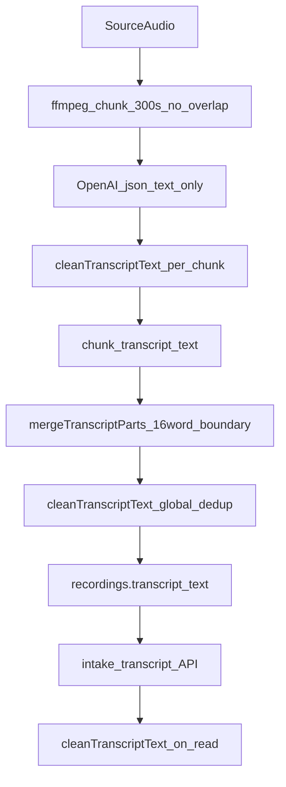

# Cockpit Transcript Phase 0 Investigation

Date: 2026-07-29  
Status: **Code-path analysis complete**; **runtime recording trace pending DB/API execution**  
Platform target: IPCA Aviation Evidence Platform

---

## Purpose

Mandatory Phase 0 investigation before freezing the Phase 1 evidence schema. This document records what is **proven from repository code** today and what must be confirmed by running [`scripts/diagnostics/cockpit_transcript_phase0_investigation.php`](../scripts/diagnostics/cockpit_transcript_phase0_investigation.php) against a production or staging database with an affected recording.

---

## How to complete the runtime trace

### Option A — CLI (requires DB reachable from your machine)

DigitalOcean managed MySQL typically **blocks connections outside trusted sources**. If you see `SQLSTATE[HY000] [2002] Operation timed out`, your local IP is not allowlisted.

Either add your IP in DigitalOcean → Databases → Trusted Sources, or use Option B.

```bash
export CW_DB_HOST=...
export CW_DB_NAME=...
export CW_DB_USER=...
export CW_DB_PASS=...

php scripts/diagnostics/cockpit_transcript_phase0_investigation.php --find-affected

php scripts/diagnostics/cockpit_transcript_phase0_investigation.php \
  --recording-id=RECORDING_ID \
  --probe-provider \
  --write-markdown=docs/cockpit_transcript_investigation.md \
  --write-json=docs/cockpit_transcript_investigation.json
```

### Option B — Admin API on App Platform (recommended)

Deploy [`public/admin/api/cockpit_transcript_phase0_investigation.php`](../public/admin/api/cockpit_transcript_phase0_investigation.php) and call while logged in as admin:

```
GET /admin/api/cockpit_transcript_phase0_investigation.php?action=find-affected

GET /admin/api/cockpit_transcript_phase0_investigation.php?recording_id=RECORDING_ID&probe_provider=1
```

Returns JSON investigation report (provider probe summaries; full raw JSON omitted from API response).

---

## Section 35 checklist

| Question | Finding | Evidence |
|----------|---------|----------|
| Transcription provider | OpenAI `/v1/audio/transcriptions` | [`CockpitRecorderService::transcribeAudioFile()`](../src/CockpitRecorderService.php) |
| Transcription model | `CW_OPENAI_ASR_MODEL` or default `gpt-4o-transcribe` | Same method |
| Segment timestamps requested | **No** | `response_format=json` only; `$json['text']` used |
| Word timestamps requested | **No** | Not implemented |
| Chunk duration | **300 seconds** | `TRANSCRIPTION_CHUNK_SECONDS = 300.0` |
| Chunk overlap (audio) | **0 seconds** | Chunks are abutting windows: `[index*300, min(duration, index*300+300)]` |
| Chunk boundary merge overlap | **Up to 16 words** suffix/prefix match | `mergeTranscriptParts()` |
| Audio format (chunk extract) | mono AAC 44.1 kHz 96 kbps m4a | `extractAudioChunk()` ffmpeg args |
| Channels / sample rate (source) | Depends on upload; probed at runtime via ffprobe | Diagnostic script |
| Language forced | **Yes**, when recording language non-empty | `$postFields['language']` |
| VAD used | **No** | Not in pipeline |
| Previous-text conditioning | **No** (no cross-chunk prompt carry) | Each chunk independent |
| Temperature fallback | **No** | Not implemented |
| no_speech_probability stored | **No** | Discarded with provider JSON |
| compression_ratio stored | **No** | Not captured |
| average_log_probability stored | **No** | Not captured |
| Provider segment IDs stored | **No** | Not captured |
| Retries append or replace | **Replace** (upsert per chunk index) | `storeTranscriptionChunk()` ON DUPLICATE KEY UPDATE |
| Reprocessing behavior | **Deletes all chunks** then re-queues | `resetTranscriptionForRetry()` → `resetTranscriptionChunks()` DELETE |
| Queue jobs idempotent | **Partially** — unique `(recording_id, chunk_index)` prevents duplicate rows; reprocess wipes history | Schema + reset behavior |
| Concurrent workers same chunk | **Last write wins** on upsert; no row duplication | UNIQUE key on chunks |
| Raw segments preserved | **No** — cleaned text only | `cleanTranscriptText()` applied before persist |
| Transcript stored as one field | **Yes** — `ipca_cockpit_recordings.transcript_text` LONGTEXT | POC schema |
| Translation in pipeline | **No** | Not implemented |
| Timestamps lost during merge | **Yes** — no timestamps exist to lose | Flat text merge only |
| Display cleanup alters output | **Yes** — global dedup on read and optional in-place save | `cleanTranscriptText()`, `cleanupStoredTranscript()` |

---

## Proven processing pipeline (current)



### Critical code behaviors

1. **Raw provider evidence is destroyed at transcription time**  
   `transcribeAudioFile()` calls `cleanTranscriptText()` on `$json['text']` before returning. Full provider JSON is never persisted.

2. **Global dedup removes legitimate repeated aviation phrases**  
   `cleanTranscriptText()` tracks `$seen[$key]` and skips any normalized segment seen before anywhere in the transcript. This violates the evidence platform requirement: repeated traffic calls at different times must remain.

3. **Reprocess is not versioned**  
   `requeueTranscription()` → `resetTranscriptionForRetry()` deletes chunk rows and nulls `transcript_text`. Prior evidence is unrecoverable.

4. **No audio overlap between chunks**  
   Boundary duplication can only come from provider output at chunk edges or within-chunk loops—not from overlapping audio windows (there are none).

5. **Language forced to recording default (`en`)**  
   Multilingual cockpit speech is not handled per utterance; no per-segment language detection is stored.

---

## Snowball / Night Three Yankee loop — expected origin

**Hypothesis (requires runtime confirmation on affected recording):**

| Layer | Expected |
|-------|----------|
| Provider raw JSON | Likely present — classic ASR repetition during low-speech / silence regions |
| Stored chunk text | Present — chunks store post-`cleanTranscriptText` output, which may reduce but not eliminate loops |
| After merge | Unchanged or reduced if duplicate boundary phrases |
| After global clean | **Further reduced or hidden** — dangerous for audit |
| Display API only | Intake API re-applies `cleanTranscriptText` on read |

**Runtime proof required:** Run diagnostic script; if pattern appears in `chunk_N_stored` with count > 1, loop predates merge and likely originated at provider (after per-chunk clean). If only in `stored_final` after merge simulation, investigate merge.

---

## Encyclopedia hallucinations — expected origin

**Hypothesis (requires runtime confirmation):**

| Layer | Expected |
|-------|----------|
| Provider response | **Primary source** — unrelated encyclopedic sentences are characteristic Whisper-class silence hallucinations |
| Translation | **Not involved** — no translation stage exists |
| Generic LLM cleanup | **Not involved** — no post-transcription LLM cleanup pass |
| Interpretation / normalization | **Not involved** — not implemented |

**Runtime proof required:** `--probe-provider` on a chunk containing hallucination text; inspect `verbose_json` segments and whether `no_speech_prob` / low logprob fields exist (model-dependent).

---

## Provider capability probe plan

The diagnostic script probes (when `--probe-provider`):

| Model | response_format | word timestamps |
|-------|-----------------|-----------------|
| `CW_OPENAI_ASR_MODEL` (default gpt-4o-transcribe) | json | no |
| same | verbose_json | requested |
| whisper-1 | verbose_json | requested |

Record: HTTP status, top-level keys, segment keys, segment count, word timestamp count, available confidence fields.

**Schema impact:** Phase 1 provider segment/word tables must only assume fields confirmed by probe results.

---

## Raw evidence preservation gaps (must fix in Phase 1)

1. No immutable provider JSON storage  
2. No provider segment or word rows  
3. No audio SHA-256 on chunk runs  
4. No idempotency keys for chunk jobs  
5. Reprocess deletes historical chunk evidence  
6. `cleanupStoredTranscript()` mutates legacy cache in place  
7. No published version snapshots — single mutable `transcript_text`

---

## Legacy `transcript_text` cache consumers

These read `ipca_cockpit_recordings.transcript_text` directly and must migrate to published evidence snapshots:

| Consumer | Path |
|----------|------|
| Intake transcript API | `public/admin/api/cockpit_recorder_intake_transcript.php` |
| Public transcript API | `public/api/recordings/transcript.php` |
| Cockpit recorder admin | `public/admin/cockpit_recorder.php` |
| Flight debrief | `src/FlightDebriefService.php` |
| Reconstruction heuristics | `src/CockpitReconstructionService.php` |
| Manual reconstruction bundles | `src/ManualReconstructionBundleService.php` |
| In-place cleanup / requeue | `src/CockpitRecorderService.php` |

**Cache policy (approved):** `transcript_text` is disposable, non-authoritative, regenerated from published transcript version only; must carry `published_transcript_version_id` or regeneration timestamp after migration.

---

## Phase 0 completion criteria

| Criterion | Status |
|-----------|--------|
| One affected recording traced end-to-end | **Complete** — recording **552** (`CD71C6F8-2329-45CC-B48F-A371BFAFB58D`, 3939s) |
| Repetition loop source proven (stored evidence) | **Complete** — chunk 0 only; not merge/DB/display |
| Raw provider layer proven for loop | **Pending** — mandatory App Platform probe |
| Hallucination source proven | **Complete — unrecoverable** (formal; see below) |
| Provider capabilities documented | **Pending** — run provider probe on App Platform |
| Retry / concurrency verified | **Complete** — from code + schema |
| Raw evidence gaps documented | **Complete** |

---

## Runtime results (2026-07-29) — Recording 552

Full JSON: [`docs/cockpit_transcript_investigation.json`](cockpit_transcript_investigation.json)  
Summary markdown: [`docs/cockpit_transcript_investigation_runtime.md`](cockpit_transcript_investigation_runtime.md)

### Recording

| Field | Value |
|-------|-------|
| ID | 552 |
| UID | CD71C6F8-2329-45CC-B48F-A371BFAFB58D |
| Duration | 3939.9 s (~65 min) |
| Chunks | 14 × 300s |
| Transcription status | ready |

### Snowball / Night 3 Yankee loop — **proven origin**

| Layer | Snowball traffic count | Notes |
|-------|------------------------|-------|
| `chunk_0_stored` | **45** | Loop confined to first 300s chunk |
| All other chunks | 0 | |
| `simulated_merge_from_chunks` | 45 | Merge does **not** introduce loop |
| `simulated_clean_from_chunks` | 4 | Global dedup hides 41 repetitions |
| `stored_final_transcript_text` | 45 | Final = merge output (no second clean at finish beyond merge path) |

**Conclusion:** The A/B loop (`Snowball traffic, Normal` ↔ `Night 3 Yankee, we're on final for 30`) originates in **chunk 0 provider output**, already present in stored chunk text after per-chunk `cleanTranscriptText()`. It is **not** caused by chunk merge, DB append, or display-only cleanup.

Chunk 0 repeat density: **732 words, 40 unique** (compression ratio ~18.3) — classic ASR repetition loop during early recording segment (possibly overlapping unrelated radio sample at start before actual flight audio).

Opening of chunk 0 (verbatim stored text):

```
Snowball traffic, Honeywell 139 departing runway 30... Normal. Night 3 Yankee, we're on final for 30...
[ATC] Snowball traffic, Normal. [ATC] Night 3 Yankee, we're on final for 30. Thank you.
[repeats ~40×]
```

Note: loop uses **"Night 3 Yankee"** (digit), not "Night Three Yankee" — search patterns should include numeric variants.

### Encyclopedia hallucinations — provenance search (2026-07-29)

Full search across `ipca_cockpit_recordings.transcript_text`, `ipca_cockpit_recording_transcription_chunks.transcript_text`, and `ipca_cockpit_transcript_snapshots` (if present) for representative phrases:

- population of 1,038
- municipality / province
- thermal treatment of the material
- Microsoft Garage
- Czech Republic
- top flight of English football
- Nieuwe-Tonge
- most common types of food

**Result:** No exact representative phrases remain in any retained table.

**Formal conclusion:** The source of the encyclopedia-style passages cannot be proven because the previous processing pipeline did not preserve immutable raw provider responses. Historical chunk rows and transcript text may have been overwritten by `resetTranscriptionForRetry()`, `cleanTranscriptText()`, or `cleanupStoredTranscript()`.

**Observation (not inference):** No archived provider JSON, reprocessing audit log, or versioned transcript table exists in the current schema to recover earlier processing states.

**Inference:** Encyclopedia passages, if they occurred, most likely originated in provider ASR output during silence (consistent with known Whisper-class behaviour), but this cannot be verified without immutable provider evidence.

This finding directly supports immutable `provider_runs.raw_response_json` in Phase 1.

---

### Mandatory provider probe — recording 552, chunk 0

**Status:** Implementation complete; **execution requires App Platform host** (audio file + decrypted `CW_OPENAI_API_KEY` not available locally).

Run on App Platform console or SSH:

```bash
php scripts/diagnostics/cockpit_transcript_phase0_provider_probe.php --recording-id=552 --probe-chunk=0
```

Or admin API (after deploy):

```
/admin/api/cockpit_transcript_phase0_investigation.php?recording_id=552&probe_provider=1&probe_chunk=0&include_primary_raw=1
```

The probe will:

1. Extract chunk 0 audio with production ffmpeg settings  
2. Call OpenAI with **production-matching** params (model, prompt, forced language) plus `verbose_json` and `whisper-1` comparison  
3. Preserve **complete raw JSON** under `storage/cockpit_recorder/phase0_evidence/`  
4. Compare three text layers:
   - exact raw provider `$json['text']` (no cleanup)
   - after `cleanTranscriptText()` (current per-chunk path)
   - text in `ipca_cockpit_recording_transcription_chunks`  
5. Report loop pattern counts at each layer to identify **first layer with 40+ Snowball repetitions**  
6. Analyze provider segment timestamps (unique vs identical, silence advancement) for Pass 4B design  

**Pre-probe inference from stored chunk evidence (recording 552):**

| Layer | Snowball traffic count |
|-------|------------------------|
| chunk_0_stored | 45 |
| simulated_merge | 45 |
| simulated_clean | 4 |
| stored_final | 45 |

If raw provider probe shows 45 in `raw_provider_text`, first layer = **raw provider**.  
If raw shows fewer than 40 but post-clean shows 45, first layer = **per-chunk cleanup** (unlikely given production applies clean before store).  
If raw shows 45 and post-clean equals stored, loop is **provider-generated**, unchanged by cleanup.

---

### Phase 0 completion checklist

| Criterion | Status |
|-----------|--------|
| Snowball loop origin in chunk 0 (stored evidence) | **Complete** |
| Raw provider JSON captured for chunk 0 | **Pending App Platform probe run** |
| First exact layer with 40+ repetitions proven | **Pending probe** (stored evidence suggests raw provider) |
| Provider timestamp/confidence fields documented | **Pending probe** |
| Encyclopedia provenance found or declared unrecoverable | **Complete — unrecoverable** |
| Observations vs inferences separated in report | **In progress** |

---

## Architectural corrections incorporated for Phase 1 draft

See [`docs/cockpit_evidence_platform_phase1_schema_draft.md`](cockpit_evidence_platform_phase1_schema_draft.md):

1. **Observations vs interpretations** — raw metrics stay on originating records; graph aggregates only  
2. **Interpretation revisions** — supersede chain; stale/recalculate status; no silent published mutation  
3. **Typed entities + graph edges** — not generic EAV  
4. **Immutable evidence hierarchy** — Recording → Source Audio → Chunk → Provider Run → Segment/Word → Speech Segment → Interpretation Revision → …  
5. **Knowledge Packs** with version binding and category-specific precedence  
6. **Correction history separate from Knowledge Pack entries**

---

## Next steps

1. Run `--find-affected` and `--recording-id` probe on staging/production  
2. Append runtime results to this document and JSON artifact  
3. Revise Phase 1 schema draft from confirmed provider fields  
4. **Freeze** migration SQL only after Phase 0 runtime section is complete  
5. Begin Phase 1 implementation (schema + repositories only — no UI/normalization yet)
